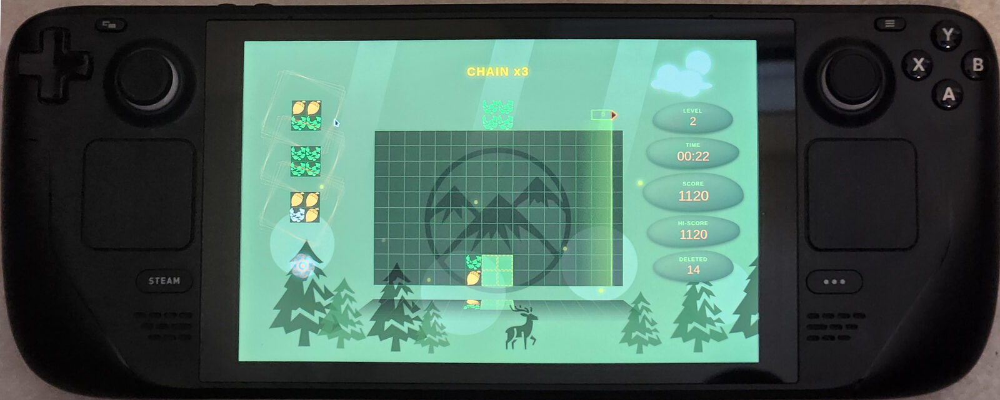
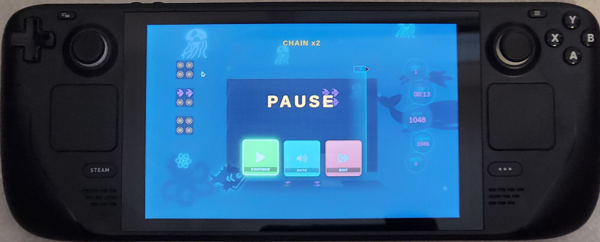

# Lumines React

A browser remake of the puzzle game **Lumines**, built with React 17 and Webpack 5.
Blocks fall in 2×2 cubes; line up same-colored 2×2 squares and a sweeper clears them
left-to-right in time with the music. Includes multiple skins, Arcade and Time Attack
modes, gamepad support, and a local leaderboard.

**▶ Play it live:** https://ereztaiar.github.io/lumines-react/ (deployed from `env/refactor-claude`)

> This is a non-commercial fan project. If you enjoy it, please **support the original
> game** — [lumines.game](https://lumines.game/).

## Play on Steam Deck

The live build runs great on a Steam Deck — open the link above in the Deck's browser
(or add it as a non-Steam game) and play with the built-in gamepad controls.

<p align="center">
  
  
</p>

## Tech stack

- **React 17** + **Webpack 5**
- **Yarn workspaces** monorepo — game logic lives in `packages/@lumines/*`, the app shell in `src/`
- **LESS** CSS modules
- **Jest** for unit tests, **Storybook** for component development

## Getting started

Requires **Node 22** and **Yarn 1.x** (Classic).

```bash
yarn install      # install dependencies
yarn watch        # dev server with hot reload at http://localhost:8080
```

### Other commands

| Command | Description |
|---------|-------------|
| `yarn watch` | webpack-dev-server, hot reload, history fallback |
| `yarn build` | production build to `dist/` |
| `yarn test` | run the Jest test suite |
| `yarn lint` | ESLint over `src` and `packages` |
| `yarn format` | Prettier, rewrites `src` and `packages` in place |
| `yarn storybook` | Storybook on port 6006 |

## Running with Docker

A multi-stage `Dockerfile` builds the app and serves the static output with nginx
(including SPA history-API fallback).

### Production (nginx)

```bash
docker compose up web --build
```

The app is served at <http://localhost:8080>.

Or without compose:

```bash
docker build -t lumines-react .
docker run --rm -p 8080:80 lumines-react
```

### Development (hot reload in a container)

Mounts the source and runs `yarn watch` inside the container:

```bash
docker compose --profile dev up dev
```

Served at <http://localhost:8080> with hot reload.

## Project layout

```
src/                      App shell, skins, utilities, tests
  skins/                  Skin registry (src/skins/index.js) + skin folders
  util/                   Game logic helpers + colocated *.test.js
packages/@lumines/
  core/                   Input handling, hooks (useKey, useClock, useTimer, useSkin)
  game-router/            Screen state machine (splash → menu → game)
  menu/                   Menu screen
  splash/                 Splash screen
  game-components/        Board, blocks, in-game UI
```

See [CLAUDE.md](./CLAUDE.md) for a deeper architecture overview (game loop, block
types, skin system).

## How to play

| Key | Action |
|-----|--------|
| ← / → | Move the falling cube |
| ↑ / Space | Rotate |
| ↓ | Hard drop |
| `p` / Esc | Pause |
| `s` | Advance to the next skin |

A standard W3C gamepad (Xbox, PS4, Steam Deck in gamepad mode, etc.) also works —
the left stick and buttons are bridged to the same keyboard events. See the
CONTROLS panel in the menu for the full keyboard/gamepad mapping.

## Assets

Sound effects and other third-party asset attributions are listed in
[ASSETS.md](./ASSETS.md).

## License

[MIT](./LICENSE)
